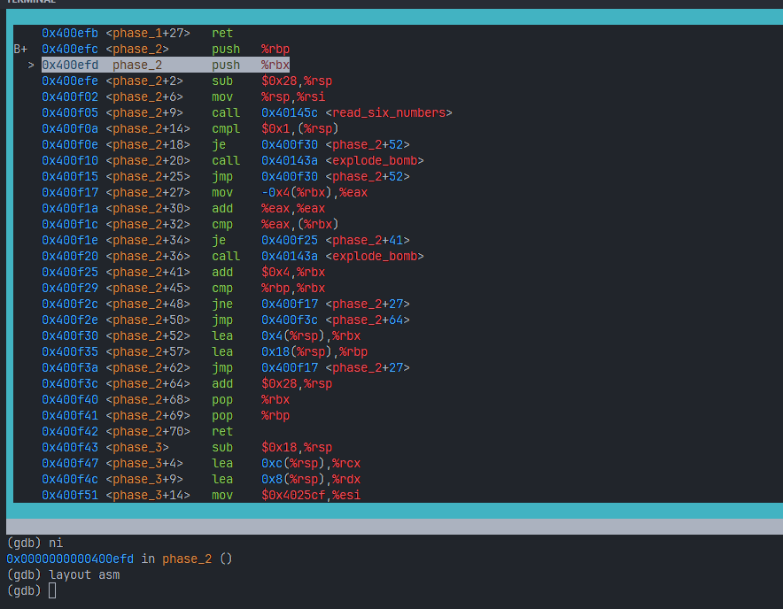
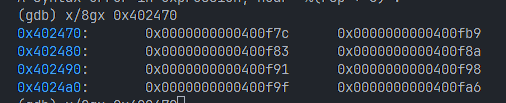
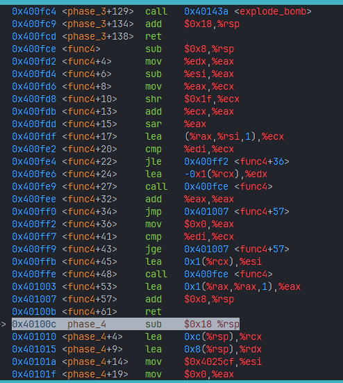
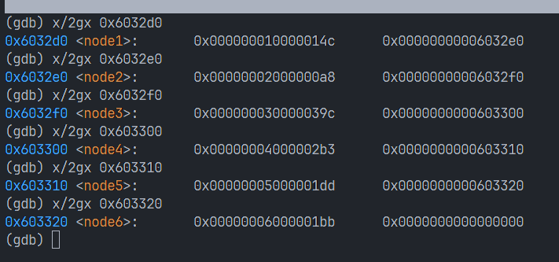

1. 调试：

```bash
gdb bomb
```

在 gdb 中调试；同时可以在 gdb 中查看 asm 汇编和 regs 寄存器状态，使用：

```bash
layout asm
layout regs
```

就可以在 gdb 上面实时显示

防止炸弹爆炸：

```gdb
break explode_bomb
```

然后在 phase 1 的入口处打一个断点，然后 `run` 就会运行到这里停下：


2. pahse 1
```bash
break phase_1
```

观察到

```asm
mov $0x402400,%esi
call 0x401388
```

也就是在调用 `string_not_equal` 这个函数之前，先把 `0x402400` 内存地址中的东西放到了 `esi` 寄存器中；而：
- `esi` 寄存器是 `rsi` 寄存器的低 32 位；
- 在调用规定中，
    - **第一个参数**必须放到 `rdi` 中
    - **第二个参数**必须放到 `rsi` 中
    - **第三个参数**必须放到 `rdx` 中
    而第一个参数是用户的输入；

使用 `x/s 0x402400` 查看内容如下：

> Border relations with Canada have never been better.

3. 


- 注意到 `read_six_numbers` 这个函数，那么上面的操作就相当于在栈上为其开辟相应的存储空间
- `(%rsp)` 相当于取出栈顶的数字，也就是输入数组中的第一个数字； `cmpl $0x1,(%rsp)` 的意思是做减法运算： `(%rsp) - 1` ，如果结果为 0 （即两个数相等），就把零标志位（ZF）设置为1； `je` 看到 1 就跳转到目标地址 `0x400f30` ，否则顺序执行，炸弹爆炸；

- `lea` ：load effective address，加载有效地址
- `0x400f40` 的指令是： `lea 0x4(%rsp),%rbx` ，就是把 `rbx` 指向栈顶往上偏移4个字节（第一个元素）
- 跳到 `0x400f17` 后， `mov -0x4(%rbx),%eax` 的意思是把 `rbx` 前面一个元素给 `eax` ；
- 然后 `add %eax,%eax` 相当于把 `rbx` 前面一个元素翻倍；
- 然后 `cmp %eax,(%rbx)` 相当于在比较 `rbx` 跟前面一个元素的两倍，如果相等的话跳转到 `0x400f25` ，否则继续往下执行，炸弹爆炸；
- `0x400f25` 处是把 `rbx` 指针继续往后移动（在不越界的情况下）；
- 所以，上面所有的事情就是在说：输入6 个数字，先看第一位是不是1，如果是的话，要求后面每个数字都是前面数字的两倍；

> 1 2 4 8 16 32

4. 
- **关键：**发现上来先调用了 `sscanf` 函数，那么很自然查看 `$0x4025cf` 里面的内容，发现是 `%d %d` ，说明这里需要输入俩整数！
- 在 `call <sscanf>` 后， `%eax` 存的是 “读到了几个数字”
- 代码紧接着用 `cmp $0x1, %eax` 检查是否大于1
- 接着判断输入是否大于等于1（是否输入有效数字），如果啥都没输入就爆炸；
- 如果输入有效数字会跳转到 `cmpl $0x7, 0x8(%rsp)` 这里；这里的意思是如果输入的第一个有效数字（注意前俩是 `%d`）大于7，那么就跳转到 explode；
- **关键：** `jmp *0x402470(,%rax,8)` 实际上是 `switch` 的汇编形式；这里是根据输入的第一个数字来跳转到对应的位置；
    
    所以要查看对应的跳转表，搞清楚是如何跳转的；使用

    ```bash
    x/8gx 0x402470
    ```

    查看跳转表如下：

    

    从左上到右下依次是 0 1 2 3 ...

- `jmp` 下面这一堆就都是跳转表，在比较输入的第二个数字和跳转的这里的数字大小，如果相等就进入 `0x400fbe`，相等的话就通过；
- 所以正确答案：
    - 0 207
    - 1 311
    - 2 707
    - 3 256
    - 4 389
    - 5 206
    - 6 682
    - 7 327

5. 
- 同样查看 `0x4025cf` 发现是 `%d %d` ，说明这里需要输入俩整数
- `cmp $0x2, %eax` 和下面的 `jne 0x401035` 说明输入如果不是两个就爆炸
- `cmpl $0xe, 0x8(%rsp)` 表示用输入第一个整数减去14
- `jbe` 是 jump below equal ，如果上面的结果小于等于则跳转，否则爆炸
- `test` 执行的是“按位与” 的操作；比如 `test %eax %eax` ，如果 `eax` 有任何一位不为 0 ， `ZF` 位就会被设为 1（表示结果是0），所以这里实际上意思是：检查上面的 `func4` 返回值是否为0！
- 查看 `func4`：

    通过

    ```bash
    disas func4
    ```

    可以查看 func4 的汇编代码，如下：

    

    这个函数实际上执行的是二分查找，并且寻找 `eax` 可以看到，只有在 `0x400ff2` 这里才有设置 `eax` 为0，否则会陷入递归中！

    要到达这里，第一个输入整数只能是输入为 7！
- 在下面的 `0x401051` 这里有对第二个输入整数进行检查，只有为 0 才能顺利跳转，否则炸弹爆炸！
- 综上， phase 4 输入是 7 0

6. 
- `mov %fs:0x28, %rax` ： stack canary!
- `xor %rax, %rax` 和 `mov $0, %rax` 一样，都可以将某个寄存器的值置0；
- `cmp $0x6, %eax` 表明 string length 必须为6，否则会直接爆炸；
    
    注意 `string_length` 函数不包括 `\0`

- `movzbl`: mov + zero-extend + byte + long: 从源地址取一个字节，把它放到一个 32 位寄存器中，并把剩下的 24 位全补0
- `movbzl (%rbx, %rax, 1), %ecx` ：取你输入字符串的第 n 个字符，放入 `%ecx` 中，高位清零

- 从 `0x40108b` 到 `0x4010ac` 是一个典型的 loop ， `for(i = 0; i < 6; i++)` ；然后执行的操作是：从输入的6个字符中取出一个，然后将其与 `0xf` 做 `and` ，也就是取低4位；然后用低4位对应的索引去 `0x4024b` 地址查表，把返回值放到一个新的数组中；

- 在 `0x4010bd` 这里调用了 `strings_not_equal` 函数，所以自然而然使用 `x/s 0x40245e` 查看需要输入的字符串，结果：

    ```bash
    flyers
    ```
- 使用 `x/s 0x4024b0` 查看密码表：

    ```bash
    maduiersnfotvbylSo you think you can stop the bomb with ctrl-c, do you?
    ```
    
    对应的索引是： 9, 15, 14, 5, 6, 7
- 查 acsii ，找低 4 位是这个索引的即可；比如： `ionefg`


7. 
- `0x401153 - 0x40116f` ：对输入的六个数字做翻转；即用 7 分别减去这六个数字
- `0x40116f - 0x4011ab` ：程序有一个预先定义好的链表，可以通过 `x/2gx 0x6032d0` 查看；这里是用输入的六个数字跟链表节点做映射；
- 然后，根据输入的指定顺序重新排列链表；比如输入 3 2 1 4 5 6，那么链表会按照 node3 -> node2 -> node1 -> node4 -> node5 -> ndoe6 重新排列
- 最后检查数值，如果前一个数值大于等于后一个则通过
- 所以，需要查看链表内部节点内的数值

    

    也就是满足条件的顺序是：3 -> 4 -> 5 -> 6 -> 1 -> 2

    也就是原始输入：4 -> 3 -> 2 -> 1 -> 6 -> 5